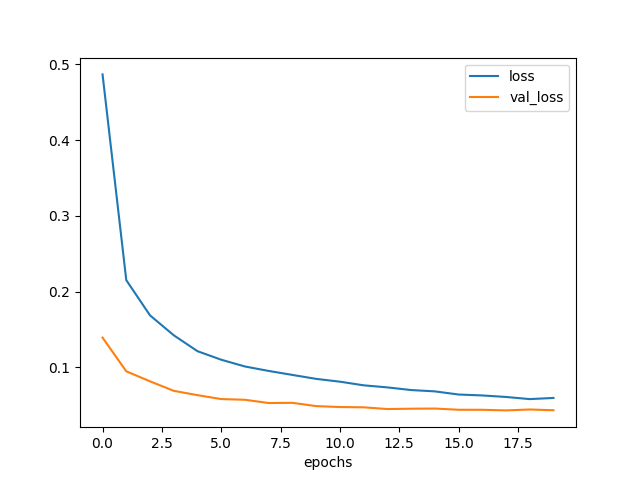
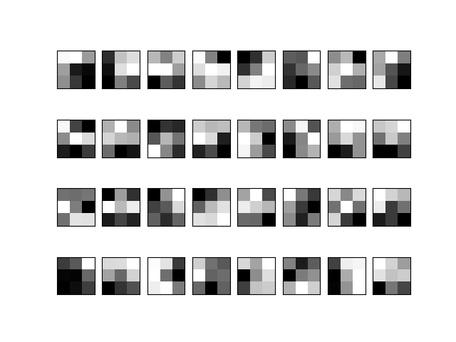
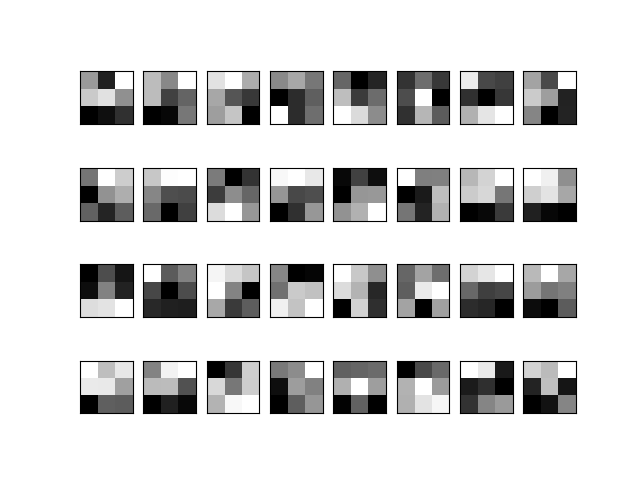
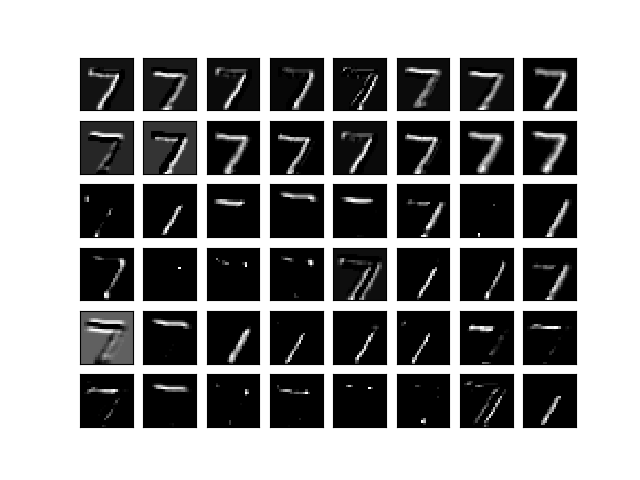
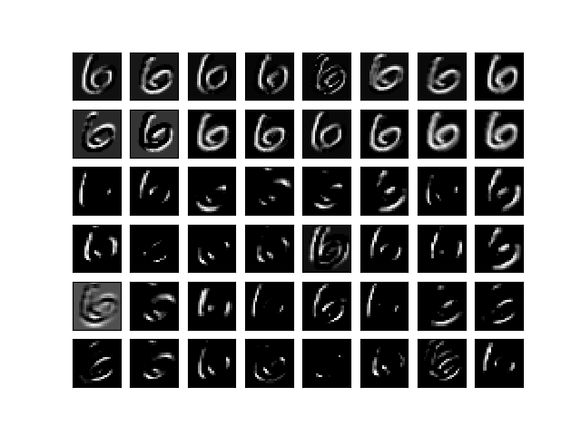
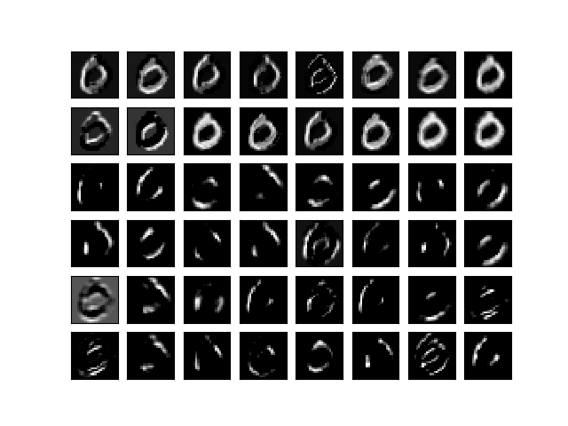

今回はついにCNNをやる。
CNNはConvolutional Neural Networkのことで、
日本語でいうと畳み込みニューラルネットワーク。

これまでのニューラルネットワークと異なる点は、畳み込み層とプーリング層があること。

### 畳み込み層

畳み込みというと、フーリエ変換とかに出てくるあれである。
フーリエ変換では元のデータに対して周期関数を周波数を変化させながら畳み込む。
こうすることで、元データに含まれる周期的な値変化が各周波数ごとに強調されたデータが得られる。ここでは周期関数をフィルタとして畳み込んでいる。

ニューラルネットワークでは小さいフィルタを用意して、学習する画像に対し畳み込む。
その働きとしては、フィルタのパターンと類似したパターンを検出することができるとのこと。
畳み込みの結果出力として、元画像に対するパターンの出現位置と類似度合いが分かる画像が得られる。
このフィルタをかけた画像を使ってニューラルネットワークで学習させるのがCNNである。

定義は以下のようになる。

サイズ $ W \times W $ の画像について、画素 $ (i, j) \  (i=0, ..., W-1, j=0, ..., W-1) $ の値を $ x_{ij} $ と表す。

フィルタは、サイズ $ H \times H $ の画像を考え、画素 $ (p, q) \  (p=0, ..., H-1, q=0, ..., H-1) $ の値を $ h_{pq} $ と表す。

このとき畳み込みは次のように計算する。

$$
u_{ij} = \sum_{p=0}^{H-1} \sum_{q=0}^{H-1} x_{i+p,j+q} h_{pq}
$$

また、上ではフィルタを1画素ずつ動かしながら畳み込んでいるが、
ストライドといって一度に $ s $ 画素ずつ動かす方法もある。
このとき畳み込みの計算は次の通り。

$$
u_{ij} = \sum_{p=0}^{H-1} \sum_{q=0}^{H-1} x_{si+p,sj+q} h_{pq}
$$

畳み込み結果の画像サイズは次のように計算できる。

$$
(\lfloor (W-1)/s \rfloor + 1) \times (\lfloor (W-1)/s \rfloor + 1)
$$

CNNではチャネルという概念があり、各画素が複数の値を持つ画像を多チャネルの画像という。
例えばRGBの画像は各画素がR、G、Bの3つの値を持つので、チャネル数は3である。
チャネル数を表わすとき、$ K $ を使う。すなわちRGBの画像は $ K = 3 $ である。

また、CNNでは畳み込み層の出力も多チャネルになる場合がある。
一枚の画像に対し $ K $ 個のフィルタを畳み込んだ結果をチャネル数 $ K $ の画像とみなしている。

$ K $ チャネルある画像に対し、$ m $ 個のフィルタを畳み込む計算は次の通り。

$$
u_{ijm} = \sum_{k=0}^{K-1} \sum_{p=0}^{H-1} \sum_{q=0}^{H-1} z_{i+p,j+q,k}^{(l-1)} h_{pqkm} + b_{ijm}
$$

ただし、 $ z_{i+p,j+q,k}^{(l-1)} $$ は、$$ l-1 $ 層から受け取ったチャネル数 $ K $ の画像の画素値を示す。
また $ b_{ijm} $ はバイアスである。
バイアスはフィルタごとに一定になることが一般的らしい。
Kerasでもそうなっている模様。

### プーリング層

プーリング層は、畳み込み層の直後に挿入することが多く、
畳み込み結果の画像をやや"ぼかす"ためのものらしい。
この層によりフィルタ結果の位置の感度を下げ、
元画像に多少の並行移動があったとしても差異を吸収することができるようになる。

プーリングで特によく使うものには2種類あり、「最大プーリング」と「平均プーリング」である。

元画像上の画素 $ (i,j) \  (i=0, ..., W-1, j=0, ..., W-1) $ を中心とした
$ H \times H $ の正方領域上の画素の集合 $ P_{ij} $ を考えると、
それぞれのプーリング層で行われる計算は次のように書ける。

#### 最大プーリング

$$
u_{ijk} = \max_{(p,q) \in P_{ij}} z_{pqk}
$$

#### 平均プーリング

$$
u_{ijk} = \frac{1}{H^2} \sum_{(p,q) \in P_{i,j}} z_{pqk}
$$

プーリング層には学習パラメータが無い。

### 例題

まずは[Kerasの公式サンプル](https://github.com/fchollet/keras/blob/master/examples/mnist_cnn.py)に従ってやってみる。

MNISTデータセットにある数字の画像データを学習し、
ある数字の画像が入力されたときそれが0〜10のどの数字であるか当てる。

入力画像は28x28のグレースケール画像である。

### 事前準備

とりあえずライブラリをインポートする。

```python
import matplotlib
matplotlib.use("Agg")
import matplotlib.pyplot as plt

import numpy as np

import keras
from keras.datasets import mnist
from keras.models import Sequential
from keras.layers import Dense, Dropout, Flatten
from keras.layers import Conv2D, MaxPooling2D
```

なんとなく定数を定義する。

```python
img_rows, img_cols = 28, 28
num_classes = 10
batch_size = 128
```

### 学習データ取得

まずはKerasの標準ライブラリでMNISTのデータセットを読み込む。

```python
(x_train, y_train), (x_test, y_test) = mnist.load_data()
```

$ x $、$ y $ を学習し易い様に変換する。

$ x $ はこのあとKerasの畳み込み層に入力するため、
縦28x横28x1チャネルのデータに変換する。
また、値域を $ 0.0 \le x_{ij} \le 1.0 $ に合わせる。

```python
x_train = x_train.reshape(x_train.shape[0], img_rows, img_cols, 1)
x_test = x_test.reshape(x_test.shape[0], img_rows, img_cols, 1)

x_train = x_train.astype('float32') / 255
x_test = x_test.astype('float32') / 255
```

$ y $ は元データだと各要素0〜10の数値が入っているが、
数値のインデックスだけ1、他は0が入った要素数10のベクトルへ各要素を変換する。

```python
y_train = keras.utils.to_categorical(y_train, 10)
y_test = keras.utils.to_categorical(y_test, 10)
```

$ x $、$ y $ のデータ数はこんな感じ。

```python
print('x_train.shape', x_train.shape)
print('x_test.shape', x_test.shape)
print('y_train.shape', y_train.shape)
print('y_test.shape', y_test.shape)
# ('x_train.shape', (60000, 28, 28, 1))
# ('x_test.shape', (10000, 28, 28, 1))
# ('y_train.shape', (60000, 10))
# ('y_test.shape', (10000, 10))
```

### モデル構築

サンプル丸写しで以下のモデルを作った。

#### 第1層: 畳み込み層

- 入力 $ x $:  ($ 28 \times 28 \times 1 $)
- フィルタ重み $ w^{(2)} $: ($ 3 \times 3 \times 1 \times 32 $)
- バイアス $ b^{(2)} $: ($ 32 \times 1 $)
- 出力 $ u^{(2)} $: ($ 26 \times 26 \times 32 $)
- 活性化関数 $ f^{(2)} $: ReLU

#### 第2層: 畳み込み層

- 入力 $ z^{(2)} $: ($ 26 \times 26 \times 32 $)
- フィルタ重み $ w^{(3)} $: ($ 3 \times 3 \times 32 \times 64 $)
- バイアス $ b^{(3)} $: ($ 64 \times 1 $)
- 出力 $ u^{(3)} $: ($ 24 \times 24 \times 64 $)
- 活性化関数 $ f^{(3)} $: ReLU

#### 第3層: プーリング層

- 入力 $ z^{(3)} $: ($ 24 \times 24 \times 64 $)
- プーリングサイズ: ($ 2 \times 2 $)
- プーリング方法: 最大プーリング
- ストライド: ($ 2 \times 2 $)
- 出力 $ u^{(4)} $: ($ 12 \times 12 \times 64 $)

#### 第4層: 全結合層

ここからはこれまでの多層パーセプトロンと同じ。

そこでこれまでと同じ様に、第4層の前にデータを1列に展開する。

- 入力 $ z^{(4)} $: ($ 9216 \times 1 $)
- フィルタ重み $ w^{(5)} $: ($ 9216 \times 128 $)
- バイアス $ b^{(5)} $: ($ 128 \times 1 $)
- ドロップアウト: $ 0.25 $
- 出力 $ u^{(5)} $: ($ 128 \times 1 $)
- 活性化関数 $ f^{(5)} $: ReLU

#### 第5層: 全結合層

今回は多クラス分類と考えられるので、最後の層は活性化関数をSoftmaxにする。

- 入力 $ z^{(5)} $$: ($$ 128 \times 1 $)
- フィルタ重み $ w^{(6)} $$: ($$ 128 \times 10 $)
- バイアス $ b^{(6)} $$: ($$ 10 \times 1 $)
- ドロップアウト: $ 0.5 $
- 出力 $ u^{(6)} $: ($ 10 \times 1 $)
- 活性化関数 $ f^{(6)} $: Softmax

このネットワーク構造やフィルタサイズ、チャネル数とかは
どういう基準で決めているのだろうか？
勘か？経験か？あるいは他にベストプラクティス的なものがあるのか？

わからないが、今後その辺を検証してみたい。

以上、このモデルを Keras では次のように表現する。

```python
model = Sequential()

model.add(Conv2D(32, kernel_size=(3, 3),
                 activation='relu',
                 input_shape=(img_rows, img_cols, 1)))
model.add(Conv2D(64, (3, 3), activation='relu'))
model.add(MaxPooling2D(pool_size=(2, 2)))
model.add(Dropout(0.25))
model.add(Flatten())
model.add(Dense(128, activation='relu'))
model.add(Dropout(0.5))
model.add(Dense(num_classes, activation='softmax'))
```

`Conv2D` ではストライドのパラメータを指定することもできるが、
ここでは省略した。省略すると、`strides=(1, 1)` を指定するのと同じになる。
パディングの指定もできるが、これも省略している。
省略すると、`padding='valid'` を指定したのと同じになる。
これはパディングを行なわない(画像の端ピッタリから畳み込みを開始する)指定である。

`MaxPooling2D` でもストライド、パディングの指定ができる。
省略すると `strides='pool_size'`、`padding='valid'`と同じになる。

最後にモデルをコンパイルしておく。

```python
model.compile(loss=keras.losses.categorical_crossentropy,
              optimizer=keras.optimizers.Adadelta(),
              metrics=['accuracy'])
```

### 訓練

いつものように訓練する。

サンプルから微妙に変えて、
訓練データセットのうち1割をバリデーションセットとして使うようにしている。

```python
hist = model.fit(x_train, y_train,
                 batch_size=batch_size,
                 epochs=20,
                 validation_split=0.1,
                 verbose=1)
```

手の爪を切っているうちに訓練が終わった。

学習したパラメータについて、テストデータセットで評価してみる。

```python
scores = model.evaluate(x_test, y_test)
print('loss={}, accuracy={}'.format(*scores))
# loss=0.0283858368165, accuracy=0.9915
```

損失 0.0284 点、精度 99.2 %。

[前回のMLPを使った勉強](https://kikei.github.io/ai/2017/08/02/mnist-mlp.html)では、最も成績の良いネットワークでも損失 0.07 点、精度 98.2 % だった。
今回の方がずっと成績が良い。

学習曲線も見てみる。

```python
plt.clf()
plt.xlabel('epochs')
plt.plot(np.arange(0, len(hist.history['loss'])),
         hist.history['loss'], label='loss')
plt.plot(np.arange(0, len(hist.history['loss'])),
         hist.history['val_loss'], label='val_loss')
plt.legend()
plt.savefig('epochs-loss.png')
```

描けた曲線が以下である。



訓練を進めると、`loss` は下がっていくが、`val_loss` は7エポックくらいで底を打った。
最終的には損失がが 0.05 点を下回っており、かなりの成績と言えそうだ。

### フィルタの可視化

せっかくだからフィルタを重みで可視化してみる。
このフィルタは、MNISTの数値画像の特徴をいい感じに抽出できるものになっているはずである。

まずは重みを読み込む。

```python
weights = model.get_weights()

[w2, b2, w3, b3, w5, b5, w6, b6] = weights
print('w2.shape', w2.shape)
print('b2.shape', w2.shape)
print('w3.shape', w3.shape)
print('b3.shape', b3.shape)
print('w5.shape', w5.shape)
print('b5.shape', b5.shape)
print('w6.shape', w6.shape)
print('b6.shape', b6.shape)
# ('w2.shape', (3, 3, 1, 32))
# ('b2.shape', (3, 3, 1, 32))
# ('w3.shape', (3, 3, 32, 64))
# ('b3.shape', (64,))
# ('w5.shape', (9216, 128))
# ('b5.shape', (128,))
# ('w6.shape', (128, 10))
# ('b6.shape', (10,))
```

まずは、第1層の畳み込み層のフィルタ重みを可視化する。

```python
plt.clf()
for i in range(0, 32):
  plt.subplot(4, 8, i+1)
  pixels = w2[:,:,0,i]
  pixels = (pixels - pixels.min()) / (pixels.max() - pixels.min())
  pixels = pixels.reshape((3, 3))
  fig = plt.imshow(pixels, cmap='gray')
  fig.axes.get_xaxis().set_visible(False)
  fig.axes.get_yaxis().set_visible(False)

plt.savefig('conv1-weight.png')
```

うーん、これはわからん。



次に、第2層の畳み込み層のフィルタ重みを可視化する。
枚数が多いのではじめの32枚だけ。

```python
plt.clf()
for i in range(0, 32):
  plt.subplot(4, 8, i+1)
  pixels = w3[:,:,i,0]
  pixels = (pixels - pixels.min()) / (pixels.max() - pixels.min())
  pixels = pixels.reshape((3, 3))
  fig = plt.imshow(pixels, cmap='gray')
  fig.axes.get_xaxis().set_visible(False)
  fig.axes.get_yaxis().set_visible(False)

plt.savefig('conv2-weight.png')
```

うーん、これもわからん。



#### フィルタ出力可視化

フィルタをみただけではわからなかったので、今度はフィルタをかけた結果を描いてみる。
1層、2層の出力を手に入れるには以下のようする。

```
layer0 = Model(inputs=model.input,
               outputs=model.layers[0].output)
z_2 = layer0.predict(x_test)

layer1 = Model(inputs=model.input,
               outputs=model.layers[1].output)
z_3 = layer1.predict(x_test)
```

描いてみる。
まずは、1層、2層それぞれの1枚目のフィルタを各画像に適用した場合にどうなるか。

プログラム:

```
plt.clf()
for i in range(0, 48):
  plt.subplot(6, 8, i+1)
  if i < 16:
    pixels = x_test[i,:,:,0]
    pixels = pixels.reshape((28, 28))
  elif i < 32:
    pixels = z_2[i-16,:,:,0]
    pixels = pixels.reshape((26, 26))
  else:
    pixels = z_3[i-32,:,:,0]
    pixels = pixels.reshape((24, 24))
  pixels = (pixels - pixels.min()) / (pixels.max() - pixels.min())
  fig = plt.imshow(pixels, cmap='gray')
  fig.axes.get_xaxis().set_visible(False)
  fig.axes.get_yaxis().set_visible(False)

plt.savefig('outputs_1.png')
```

結果:


上2段がオリジナルの画像、中2段が第1層の出力、下2段が第2層の出力である。
中2段はパッと見オリジナルを少しぼやけただけのようだが、
よくみると右上から左下方向伸びる線が薄くなったように見える。
言い換えると、右上から左下方向以外の強めるフィルタになったということか。

下2段ではオリジナルと比べ、上下方向(やや左下方向)の線だけが残され他が消えてしまっている。
これは上下方向を強調するフィルタだったようだ。

せっかくなので他のフィルタも試してみる。
ここから3枚の図は 7, 0, 6 が書かれた画像についてそれぞれ 16 種類のフィルタを
かけたものだ。

```
for ans, idx in [(7, 0), (0, 3), (6, 11)]:
  plt.clf()
  for i in range(0, 48):
    plt.subplot(6, 8, i+1)
    if i < 16:
      pixels = z_2[idx,:,:,i]
      pixels = pixels.reshape((26, 26))
    else:
      pixels = z_3[idx,:,:,i-16]
      pixels = pixels.reshape((24, 24))
    pixels = (pixels - pixels.min()) / (pixels.max() - pixels.min())
    fig = plt.imshow(pixels, cmap='gray')
    fig.axes.get_xaxis().set_visible(False)
    fig.axes.get_yaxis().set_visible(False)
  
  plt.savefig('filtered_{}.png'.format(ans))
```

まずは 7。



次が 6。



最後に 0。



それぞれ、同じオリジナルの画像に対しフィルタを変えながら畳み込んだ結果である。
上2段が第1層の出力、下4段が第2層の出力。

特徴らしきものが抽出された気がする。
特に最下段右から2番目では輪郭が抽出された。


ちなみに一度は `conv2d` を自作しようと試みた。
多層ニューラルネットワークでは大量の畳み込みを実行するので
、普通にループで計算させるととても時間がかかる。
そこで高速化のテクニックとして `im2col` というものがあり、これは
畳み込み処理をできるだけ1回の行列乗算にまとめて計算する。
ただしテンソルを1列に展開する際に巨大なインデックス情報を生成するため
メモリ使用量が非常に多い。この計算のためにわざわざ自宅検証機のメモリを
16 GB も増量したのだが、それでも `Memory Error` になってしまった。
今回は諦めるがいつかの宿題としたい。

```
Traceback (most recent call last):
  File "<stdin>", line 1, in <module>
  File "<stdin>", line 7, in conv2d
  File "<stdin>", line 14, in im2col
MemoryError
```
