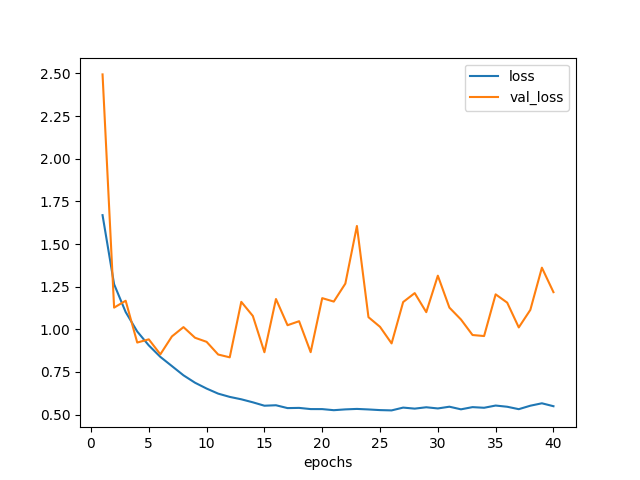
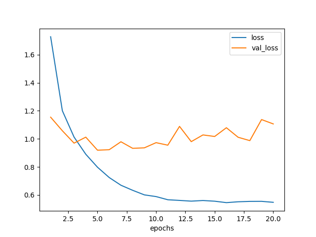
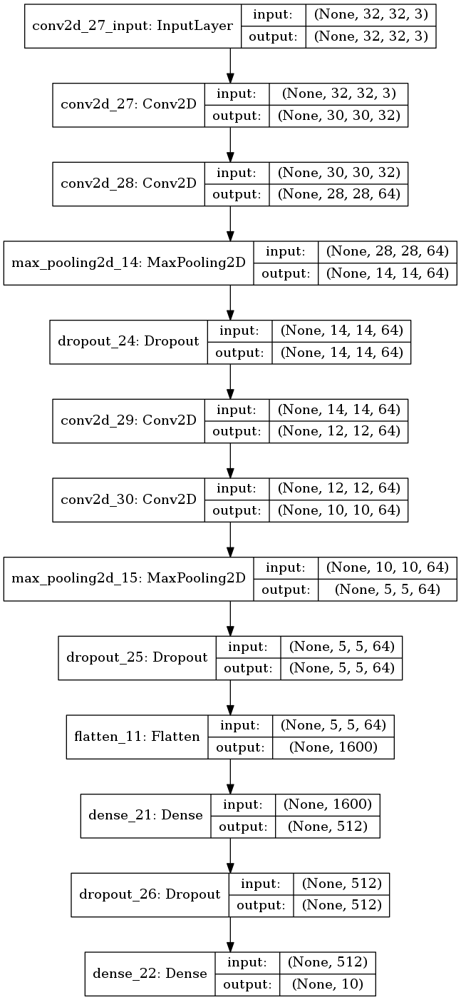
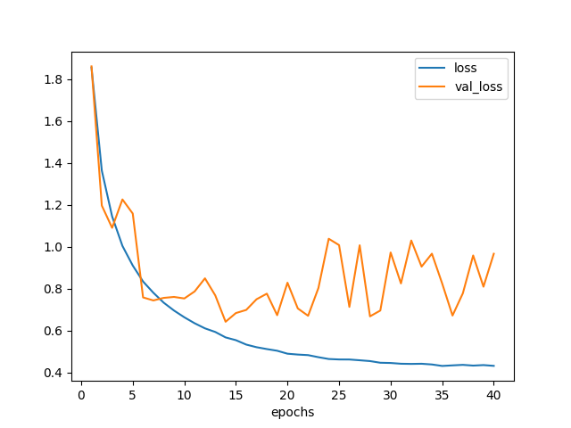
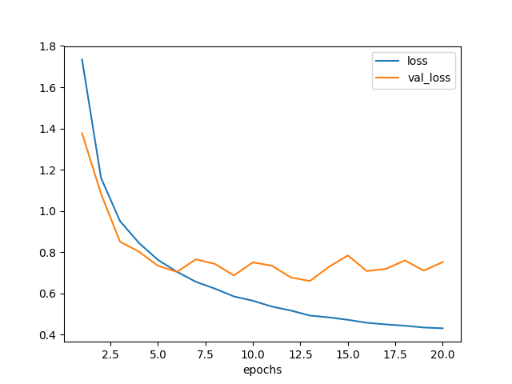
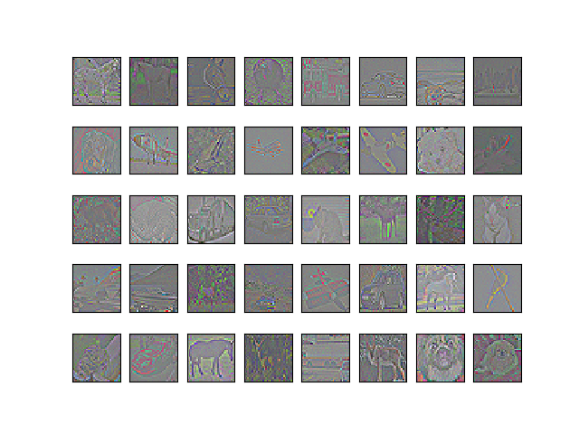
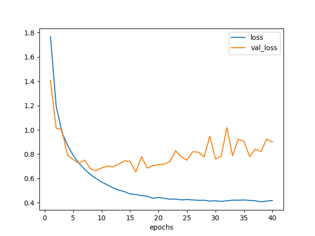

[前々回には CIFAR-10 のデータセットを使い画像分類を行った](/ai/2018/03/25/cifer10-cnn1.html)が、正解率はいまいちだった。

そこで[前回はデータ前処理](/ai/2018/03/28/cifar10-whitening.html)の勉強をした。

今回はZCA白色化したデータを使って学習させ、効果の程を見てみる。

ZCA白色化は Keras の ImageDataGenerator を使って実現する。

### 1. 事前準備

お馴染のライブラリインポートとデータセット読み込みの他、
ImageDataGeneratorのインポートも行う。

```
# Matplotlib
import matplotlib
matplotlib.use("Agg")
import matplotlib.pyplot as plt

# Numpy
import numpy as np

# Keras
import keras
from keras import backend as K
from keras.datasets import cifar10
from keras.models import Model, Sequential
from keras.layers import Dense, Dropout, Flatten
from keras.layers import Conv2D, MaxPooling2D
from keras.utils import plot_model
from keras.preprocessing.image import ImageDataGenerator

# グローバル設定
img_rows, img_cols, img_channels = 32, 32, 3
num_classes = 10
batch_size = 64

# データセット読み込み
(x_train, y_train), (x_test, y_test) = cifar10.load_data()

x_train = x_train.astype('float32') / 255
x_test = x_test.astype('float32') / 255
y_train = keras.utils.to_categorical(y_train, num_classes)
y_test = keras.utils.to_categorical(y_test, num_classes)
```

今回、バリデーションセットは自前で作成した。

これまでは `model.fit` の `split_validation` パラメータを使っていたが、
ImageDataGenerator を使う版の `model.fit_generator` にはそのパラメータが無い。

下記 `split_validation` 関数は、
入力したデータをトレーニングセットとバリデーションセットに分けて返す。

```
def split_validation(x, y, frac):
  N = x.shape[0]
  N_validation = int(round(N * frac))
  N_split = N - N_validation
  x_train = x[range(0, N_split)]
  x_validation = x[range(N_split, N)]
  y_train = y[range(0, N_split)]
  y_validation = y[range(N_split, N)]
  return (x_train, x_validation), (y_train, y_validation)

(x_train, x_validation), (y_train, y_validation) = split_validation(x_train, y_train, 0.1)
print('x_train.shape', x_train.shape)
# ('x_train.shape', (45000, 32, 32, 3))
print('y_train.shape', y_train.shape)
# ('y_train.shape', (45000, 10))
print('x_validation.shape', x_validation.shape)
# ('x_validation.shape', (5000, 32, 32, 3))
print('y_validation.shape', y_validation.shape)
# ('y_validation.shape', (5000, 10))
```

### 2. ImageDataGenerator を使った ZCA白色化

トレーニングデータ、バリデーションデータ、テストデータが
学習時にそれぞれ白色化されるように ImageDataGenerator を設定する。

```
train_datagen = ImageDataGenerator(zca_whitening=True)
train_datagen.fit(x_train)
train_generator = train_datagen.flow(x_train, y_train, batch_size=batch_size)

validation_datagen = ImageDataGenerator(zca_whitening=True)
validation_datagen.fit(x_validation)
validation_generator = validation_datagen.flow(x_validation, y_validation, batch_size=batch_size)

test_datagen = ImageDataGenerator(zca_whitening=True)
test_datagen.fit(x_test)
test_generator = test_datagen.flow(x_test, y_test, batch_size=batch_size)
```

ImageDataGenerator はZCA白色化以外にも、画像データを読み込んだり、
回転や色の前処理による訓練データ水増しなどを行う場合にも便利に使うことができる。

### 3. 学習 モデルその1 白色化無し

#### モデル構築

まずは前つかったやつと同じモデル。

```
def make_model1():
  model = Sequential()
  model.add(Conv2D(32, kernel_size=(3, 3),
                   strides=(1, 1), padding='valid',
                   activation='relu',
                   input_shape=(img_rows, img_cols, img_channels)))
  model.add(Conv2D(64, (3, 3), activation='relu'))
  model.add(MaxPooling2D(pool_size=(2, 2)))
  model.add(Dropout(0.25))
  model.add(Flatten())
  model.add(Dense(128, activation='relu'))
  model.add(Dropout(0.5))
  model.add(Dense(num_classes, activation='softmax'))
  model.compile(loss=keras.losses.categorical_crossentropy,
                optimizer=keras.optimizers.Adadelta(),
                metrics=['accuracy'])
  return model
```

可視化もしておく。

```
plot_model(model, to_file='model1.png', show_shapes=True)
```


*図 3.1. これまでと同じモデル*

#### 訓練

前回もやった気がするが、白色化無しで普通に学習させてみた。

ほぼ前回と同じ。異なるのは `validation_split` を使わずに、
`validation_data` としてバリデーションセットを明示的に渡していることくらい。

```
# Model1 Basic
model = make_model1()
hist = model.fit(x_train, y_train, batch_size=batch_size,
                 epochs=40,
                 validation_data=(x_validation, y_validation),
                 verbose=1)
```

テストセットに対する認識精度は正解率 72% になった。

```
scores = model.evaluate(x_test, y_test)
print('loss={}, accuracy={}'.format(*scores))
# loss=1.24401199303, accuracy=0.719
```

学習曲線は以下のようになった。
念のため 40 エポック回したが、20 エポックくらいでバリデーション損失は底を打っている模様。

```
plt.clf()
plt.xlabel('epochs')
plt.plot(np.arange(1, len(hist.history['loss'])+1),
         hist.history['loss'], label='loss')
plt.plot(np.arange(1, len(hist.history['loss'])+1),
         hist.history['val_loss'], label='val_loss')
plt.legend()
plt.savefig('model1_loss.png')
```



*図3.2. 白色化無しデータでモデル1を訓練した場合の学習曲線*


### 4. 学習 モデルその1 ZCA白色化

今度は同じモデルを使い、ZCA白色化したデータに対して学習させたらどうなるか実験する。

#### 訓練

白色化バージョンでは、事前準備で用意した ImageDataGenerator オブジェクトを使い、
以下のようなプログラムで学習させる。

`fit` の代わって `fit_generator` を、
`evaluate` の代わって `evaluate_generator` を利用している。

```
# Model1 ZCA
model = make_model1()
hist = model.fit_generator(train_generator,
                           steps_per_epoch=x_train.shape[0] // batch_size,
                           epochs=20,
                           validation_data=validation_generator,
                           verbose=1)
```

割と時間かかる。何故？

そして正解率だが、67%。白色化無しの場合と比べて 5% も悪くなっている！何故？？

```
scores = model.evaluate_generator(test_generator)
print('loss={}, accuracy={}'.format(*scores))
# loss=1.02163907175, accuracy=0.6749
```

学習曲線は以下。
5 エポックくらいで精度向上が終わった模様。

```
plt.clf()
plt.xlabel('epochs')
plt.plot(np.arange(1, len(hist.history['loss'])+1),
         hist.history['loss'], label='loss')
plt.plot(np.arange(1, len(hist.history['loss'])+1),
         hist.history['val_loss'], label='val_loss')
plt.legend()
plt.savefig('model1_zca_loss.png')
```



*図4.1. ZCA白色化データでモデル1を訓練した場合の学習曲線*

ZCA白色化すれば精度は上がると聞いていたが、そうでは無い場合もあるらしい。

なぜだろう？白色化によっていくらか情報が落ちてしまったのだろうか？

残念な結果になってしまったがいったん置いておき、
もう少し深いネットワークで学習させてみた。

### 5. 学習 モデルその2 白色化無し

#### モデル構築

モデルその1に対し、畳み込み層×2とプーリング層×1を追加した。
理由は参考サイトでそうしていたから。

```
def make_model2():
  model = Sequential()
  model.add(Conv2D(32, kernel_size=(3, 3),
                   strides=(1, 1), padding='valid',
                   activation='relu',
                   input_shape=(img_rows, img_cols, img_channels)))
  model.add(Conv2D(64, (3, 3), activation='relu'))
  model.add(MaxPooling2D(pool_size=(2, 2)))
  model.add(Dropout(0.25))
  model.add(Conv2D(64, (3, 3), activation='relu'))
  model.add(Conv2D(64, (3, 3), activation='relu'))
  model.add(MaxPooling2D(pool_size=(2, 2)))
  model.add(Dropout(0.25))
  model.add(Flatten())
  model.add(Dense(512, activation='relu'))
  model.add(Dropout(0.5))
  model.add(Dense(num_classes, activation='softmax'))
  model.compile(loss=keras.losses.categorical_crossentropy,
                optimizer=keras.optimizers.Adadelta(),
                metrics=['accuracy'])
  return model

plot_model(make_model2(), to_file='model2.png', show_shapes=True)
```

モデルの可視化結果は以下。
6層の Conv2d から9層の Dropout までを追加した。



*図5.1. ZCA白色化データでモデル1を訓練した場合の学習曲線*

#### 訓練

まずは白色化無しの方から。

認識精度は 74% になった。先のモデルよりも 2% だけ改善している。
誤差の範囲内か？

```
# Model2 Basic
model = make_model2()
hist = model.fit(x_train, y_train, batch_size=batch_size,
                 epochs=40,
                 validation_data=(x_validation, y_validation),
                 verbose=1)
scores = model.evaluate(x_test, y_test)
print('loss={}, accuracy={}'.format(*scores))
# loss=0.985883926582, accuracy=0.7382
```

学習曲線は次のようになった。

```
plt.clf()
plt.xlabel('epochs')
plt.plot(np.arange(1, len(hist.history['loss'])+1),
         hist.history['loss'], label='loss')
plt.plot(np.arange(1, len(hist.history['loss'])+1),
         hist.history['val_loss'], label='val_loss')
plt.legend()
plt.savefig('model2_loss.png')
```

だいたい20エポックくらいで底を打っている。




*図5.2. 白色化無しデータでモデル2を訓練した場合の学習曲線*

### 6. 学習 モデルその2 ZCA白色化

今度は、モデルその2をZCA白色化したデータで訓練してみる。

#### 訓練

認識精度は 78% になり、白色化無し版よりも 4% 改善した。

```
### Model2 ZCA
model = make_model2()
hist = model.fit_generator(train_generator,
                           steps_per_epoch=x_train.shape[0] // batch_size,
                           epochs=20,
                           validation_data=validation_generator,
                           verbose=1)
scores = model.evaluate_generator(test_generator)
print('loss={}, accuracy={}'.format(*scores))
# loss=0.748378943443, accuracy=0.776
```

ただちょっと時間がかかった。こんなに時間かかる意味は？

学習曲線も描いた。
6エポックくらいで底になったように見えるが、実はまだいけるのかもしれない。

```
plt.clf()
plt.xlabel('epochs')
plt.plot(np.arange(1, len(hist.history['loss'])+1),
         hist.history['loss'], label='loss')
plt.plot(np.arange(1, len(hist.history['loss'])+1),
         hist.history['val_loss'], label='val_loss')
plt.legend()
plt.savefig('model2_zca_loss.png')
```



*図6.1. ZCA白色化データでモデル2を訓練した場合の学習曲線*

層を増やしたところ、ZCA白色化の効果が得られるようになった。

### 7. おまけ ZCA白色化した画像の出力

上の方法はバッチごとにZCA白色化をしているが、全部一括で処理してみた。

`batch_size` をトレーニングデータの数にすればよい。

```
train_datagen = ImageDataGenerator(zca_whitening=True)
train_datagen.fit(x_train)
train_generator = train_datagen.flow(x_train, y_train, batch_size=len(x_train))
x_train_pca, y_train_pca = train_generator.next()
```

ちゃんと白色化できているか確認するため描いてみた。
見易くするため、画像1枚ごとに全チャネルで 0〜1 の値域になるよう正規化した。

```
def normalize_image(img):
  vmin = np.min(img)
  vmax = np.max(img)
  return (img - vmin) / (vmax - vmin)

plt.clf()
for i in range(0, 40):
  plt.subplot(5, 8, i+1)
  pixels = normalize_image(x_train_pca[i,:,:,:])
  fig = plt.imshow(pixels)
  fig.axes.get_xaxis().set_visible(False)
  fig.axes.get_yaxis().set_visible(False)

plt.savefig('cifar10_zca.png')
```

見たことのある感じの画像になった。
各画像の輪郭が抽出されている。



*図7.1. ZCA白色化後の画像*

これをモデルその2で訓練したらどうなるか？
項6. と同じ結果になって欲しいところである。

```
test_datagen = ImageDataGenerator(zca_whitening=True)
test_datagen.fit(x_test)
test_generator = train_datagen.flow(x_test, y_test, batch_size=len(x_test))
x_test_pca, y_test_pca = test_generator.next()

model = make_model2()
hist = model.fit(x_train_pca, y_train_pca, batch_size=batch_size,
                 epochs=40,
                 validation_split=0.1,
                 verbose=1)
```

認識精度は 77% になった。予想通りといってよさそうだ。

```
scores = model.evaluate(x_test_pca, y_test_pca)
print('loss={}, accuracy={}'.format(*scores))
# loss=0.970912769604, accuracy=0.7674
```

いちおう、学習曲線の様子は以下。

```
plt.clf()
plt.xlabel('epochs')
plt.plot(np.arange(1, len(hist.history['loss'])+1),
         hist.history['loss'], label='loss')
plt.plot(np.arange(1, len(hist.history['loss'])+1),
         hist.history['val_loss'], label='val_loss')
plt.legend()
plt.savefig('model2_zca_loss2.png')
```



*図7.2. ZCA白色化データでモデル2を訓練した場合の学習曲線 一括ver.*

バッチ単位で処理しても、画像全体で一気に処理しても、
結果の成績は同じになったが後者の方が実行時間は短かくて済んだ。

バッチ単位の場合、各ステップごとに白色化の処理を行っていると思われ、
これが遅い原因だろう。

画像全体で一気に処理する場合には、
初めにやや時間がかかるのと、おそらくメモリが少し多く必要になると思われるが、
エポック数を多く回すのならばこっちの方がよさそうだ。

### 8. 参考

- [Image Preprocessing - Keras Documentation](https://keras.io/preprocessing/image/)
- [Kerasによるデータ拡張](http://aidiary.hatenablog.com/entry/20161212/1481549365)
- [python - How dows data normalization work in keras during prediction? - Stack Overflow](https://stackoverflow.com/questions/41855512/how-does-data-normalization-work-in-keras-during-prediction/43069409)
- [TensorFlowからKerasに乗り換えてみた - test.py](http://testpy.hatenablog.com/entry/2017/06/25/201419)
